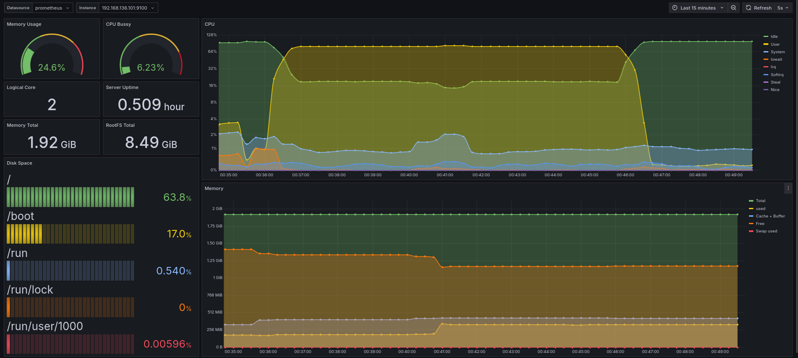
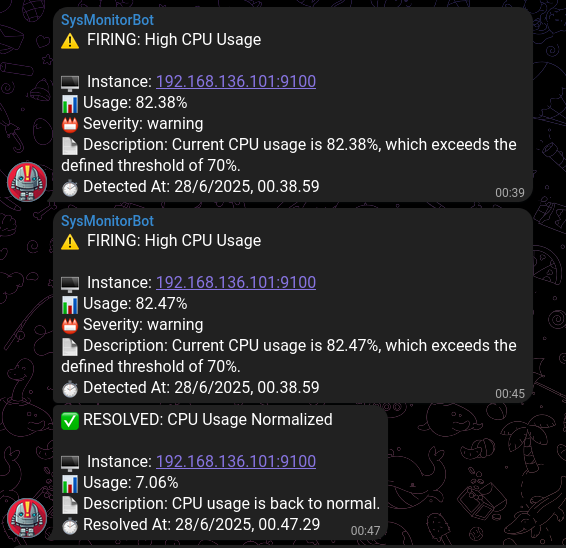
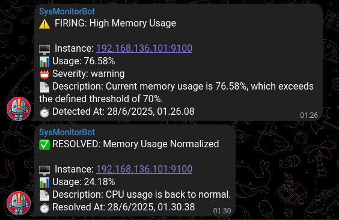
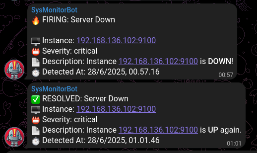

# Server-observability-nodehook
A simple and scalable server observability prototype using Prometheus, Grafana, Alertmanager, and Telegram integration.


---


### 📌 Description
This project is a prototype of an **observability monitoring system** for servers, built using the following stack:

- **Prometheus** for metrics collection
- **Grafana** for dashboard visualization
- **Alertmanager** for alert handling and routing
- **Webhook API (Node.js)** as a receiver to forward alert notifications to Telegram

Before developing the Webhook Receiver, I first created a Grafana dashboard to monitor server resource utilization, including **CPU**, **memory**, **disk**, and **network usage**.


### 🔄 System Flow:

📈 Prometheus ➡️ 🚨 Alertmanager ➡️ 🛠️ Webhook API ➡️ 📲 Telegram

When certain conditions are met (e.g., CPU usage exceeds 90%), Alertmanager sends the alert to the custom Webhook endpoint I built. This API formats the alert message and forwards it to a Telegram bot for real-time notification.

---

### 🚀 Features

- 🔍 **System Monitoring via Prometheus**
    - Collects system-level metrics on Linux (CPU, Memory, Disk, Network)
    - Scrapes metrics using Node Exporter

- 📊 **Real-Time Dashboards with Grafana**
    - Visualizes metrics in intuitive dashboards
    - Custom panels for resource usage, uptime, and more

- 🚨 **Alerting via Alertmanager**
    - Trigger rules for critical conditions (e.g., CPU > 90%)
    - Routes alerts to a custom webhook receiver

- 💬 **Custom Webhook Backend (Node.js + Express)**
    - REST API endpoint to receive alerts from Alertmanager
    - Parses and formats alert payloads (JSON) before forwarding

- 📲 **Telegram Notification Integration**
    - Forwards alerts to a Telegram bot
    - Uses readable message formats for better clarity

- 🧪 **Scalable Prototype Design**
    - Entire monitoring stack runs locally (VM) as a proof-of-concept
    - Built using open-source, production-ready tools (Prometheus, Grafana, etc.)
    - Ready to be scaled to staging or production environments


---

### 🛠️ Technologies Used

The following are the main technologies and tools used in the development of this project:

- **Node Exporter**  
  A lightweight Prometheus agent that exports system metrics (CPU, memory, disk, network) from a Linux host.

- **Prometheus**  
  A time-series database and monitoring engine used to scrape and store metrics from various sources.

- **Grafana**  
  A powerful data visualization platform used to create monitoring dashboards from Prometheus metrics.

- **Alertmanager**  
  A Prometheus component responsible for alert routing, grouping, and sending notifications based on defined rules.

- **Express.js (Node.js)**  
  Used to build the Webhook Receiver API that accepts alerts from Alertmanager and forwards them to Telegram.

- **Stress-ng**  
  A command-line tool used to simulate high system load, useful for testing the alerting behavior under stress.

- **Telegram Bot API**  
  Used by the Webhook to send real-time alert notifications to a Telegram chat or group.

---


### 📸 Demo & Screenshots

#### 📊 1. Grafana Monitoring Dashboard

> Real-time server resource usage visualization, including **CPU**, **Memory**, **Disk**, and **Network**.

<div align="center">
  
  <br/>
  <em>Custom Grafana panel showing system metrics</em>
</div>
<br>

<div align="center">
  
  <br/>
  <em>Server Utilization Overview</em>
</div>
<br>

<div align="center">
  
  <br/>
  <em>Displays CPU usage percentage (busy) using Prometheus data, visualized with a Grafana gauge panel.</em>
</div>
<br>

---

#### 🚨 2. Telegram Alert Notification

> Example alert notifications sent to Telegram when critical conditions are detected.

<div align="left">
  
  <br/>
  <em>Telegram alert triggered when CPU usage exceeds thresholds</em>
</div>
<br>

<div align="left">
  
  <br/>
  <em>Telegram alert triggered when memory usage exceeds thresholds</em>
</div>
<br>

<div align="left">
  
  <br/>
  <em>Telegram alert for server down and recovery (up again)</em>
</div>


### ⚙️ Prerequisites

Ensure your system has the following installed before running the project:

- **Node.js** (v18 or later is recommended)

> All other dependencies will be installed automatically via `npm install` as defined in `package.json`.

### 🔑 Telegram Bot Configuration

Before running the application, create a `.env` file in the project root with your Telegram bot token and chat ID:

```
BOT_TOKEN=your-telegram-bot-token
CHAT_ID=your-chat-id
```

> **Note:**  
> The `.env` file is ignored by git for security reasons. Make sure to create and fill it with your own credentials.


### 🚀 Installation

```bash
# Clone the repository
git clone https://github.com/adrissh/server-observability-nodehook.git

# Navigate to the project directory
cd server-observability-nodehook

# Install dependencies
npm install

# Run the application
npm start


```
### 🔧 Configuration Files

All main configuration files are organized into dedicated subfolders inside the `/config` directory:

- `/config/prometheus/`  
  Contains Prometheus configuration (`prometheus.yml , alert.rules.yml , recording.rules.yml`) and alert rules.

- `/config/alertmanager/`  
  Contains Alertmanager configuration (`alertmanager.yml`) for routing and receivers.

> **Note:**  
> There is no custom configuration for Grafana in this project. You can use Grafana directly and connect it to Prometheus as a data source.


### 📄 License
This project is licensed under the MIT License.

### 📬 Contact
[](mailto:adrilukman73@gmail.com)
[](https://www.linkedin.com/in/adri-lukman-8b85521b8/)